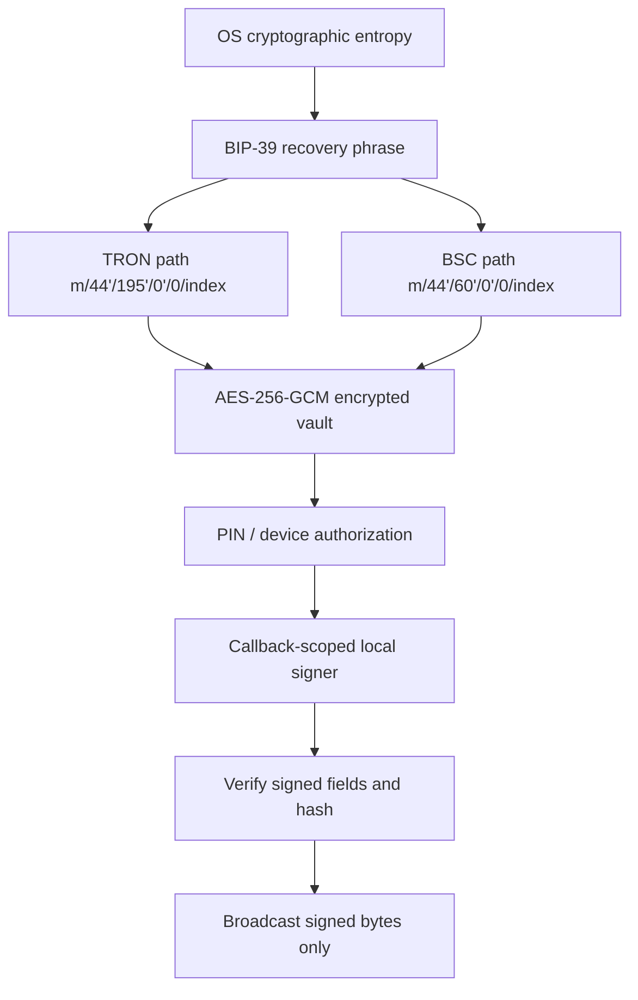

# TRONOXA Security Core

[](https://github.com/mharb787/tronoxa-security-core/actions/workflows/security.yml)
[](https://github.com/mharb787/tronoxa-security-core/actions/workflows/build.yml)
[](LICENSE)

This repository publishes the security-sensitive wallet code used by TRONOXA for independent inspection. It contains TRON key derivation, encrypted-vault handling, transaction validation and local signing, plus the **actual BEP-20/BSC core package and mobile integration code** used by the application.

It is not the complete TRONOXA product. UI, branding, pricing, order orchestration, deployment configuration and unrelated backend business logic remain outside this repository. The published security files are open source under MPL-2.0; the vendored BSC package retains Apache-2.0.

## Security architecture



### Client-side keys

- Recovery phrases follow BIP-39. TRON accounts use the SLIP-44 coin type 195 path `m/44'/195'/0'/0/index`.
- BSC accounts use the Ethereum-compatible coin type 60 path `m/44'/60'/0'/0/index`.
- Private keys and recovery phrases are derived and used on the device. They are never required by the TRONOXA backend, RPC provider or relay.
- Wallet secrets are encrypted with AES-256-GCM using a random 256-bit key, a 96-bit IV and a 128-bit authentication tag. The ciphertext and encryption key are kept across separate storage boundaries; see `src/wallet/vault-codec.ts` and `src/wallet/storage.ts`.
- JavaScript cannot guarantee physical memory erasure. The BSC signer therefore limits secret lifetime, scopes signing to a callback, overwrites mutable key byte arrays when possible and promptly drops references.

### Non-custodial and “zero-knowledge” boundary

TRONOXA is non-custodial: the service has no wallet-secret database and cannot reconstruct a wallet or sign a transaction. A backend exists for non-secret functions such as authenticated RPC relay, notifications and product services, but it receives public addresses, transaction hashes and already-signed raw transactions—not seed phrases or private keys.

“Zero-knowledge” here describes this custody boundary; it does **not** claim use of a formal zero-knowledge proof protocol.

### TRON signing controls

- Transaction meaning is validated before signing.
- Imported/multisig transactions are restricted to reviewed contract types and operations.
- The signed transaction is recovered and checked before broadcast.
- TRC-20 transfers bind token contract, recipient and integer base-unit amount.

### BEP-20/BSC signing controls

The shipped BSC implementation is public in two layers:

- `packages/bsc-core/`: exact executable JavaScript and TypeScript declarations extracted from the vendored `@tronoxa/bsc-core@0.1.0` package used by the app.
- `integrations/mobile-bsc/`: exact application integration source at the recorded production commit, including signer authorization, RPC/relay allowlists, fee and balance guards, quote expiry, nonce coordination, signed-field verification, broadcast-hash comparison and pending-transaction recovery.

Mainnet/testnet chain IDs are closed to 56/97 and checked against RPC responses. BEP-20 transfers use a code-reviewed token allowlist and exact `transfer(address,uint256)` calldata; arbitrary approvals and arbitrary contract calls are out of scope. Only the signed raw transaction can be relayed.

See [BSC provenance](provenance/BSC_PROVENANCE.md) and [threat model](packages/bsc-core/THREAT_MODEL.md).

## Wallet interoperability

A valid 12-word BIP-39 recovery phrase is portable. Importing it into TronLink, Trust Wallet or another TRON wallet that uses the same TRON derivation path should reproduce the same TRON account. BSC wallets must use the coin-type-60 path above. Always verify the first public address before transferring funds; wallets that choose a different account index or derivation path can display a different address from the same phrase.

Never paste a funded recovery phrase into a website, issue, test, screenshot or support chat.

## Install and validate

Requirements: Node.js 20+ and npm.

```bash
git clone https://github.com/mharb787/tronoxa-security-core.git
cd tronoxa-security-core
npm ci
npm run build
npm test
npm run verify:provenance
```

These checks use synthetic fixtures only and do not connect to a funded wallet.

## Reproducible package verification

Tag builds create deterministic source/package archives, generate `SHA256SUMS` and attach them to the matching GitHub Release. To verify a downloaded artifact:

```bash
sha256sum --check SHA256SUMS
```

The exact BSC archive currently vendored by the application has:

```text
SHA-256  d0f0989fcf708d6f4bd85a28b82e47b11db7124a45c752c38404c2c3f03119df
Git blob ef0a047e9208b3421bb3c8ec2107b407b369c506
```

The extracted public files are independently covered by [bsc-files.sha256](provenance/bsc-files.sha256).

## Scope and trust claims

- Source publication and automated scanning improve verifiability; they do not prove the absence of vulnerabilities.
- No independent paid audit is claimed. Automated reports are evidence, not an audit certificate.
- Store builds must be matched to a release checksum/provenance statement before claiming binary equivalence.
- Current source fidelity and exclusions are recorded in [PUBLISHED_SCOPE.md](PUBLISHED_SCOPE.md).

## Reporting vulnerabilities

Do not disclose wallet-impacting issues publicly before a fix is available. Follow [SECURITY.md](SECURITY.md) and use GitHub private vulnerability reporting.

## License

TRON security and mobile-integration files are licensed under [MPL-2.0](LICENSE). The exact BSC core snapshot under `packages/bsc-core/` is licensed under its included [Apache-2.0 license](packages/bsc-core/LICENSE).
